# RDMA
Open source reference data management solution for business users. 

## Requirements
- Java 8 or higher
- Apache Maven
- Apache Tomcat 8.5 or higher as application server
- Database of your choice (MySQL, Postgres, SQL Server, ...) to host RDMA meta-db
- [CAS](https://github.com/rdmaorg/cas_single_signon) application for Single Sign-On

### Architecture layout
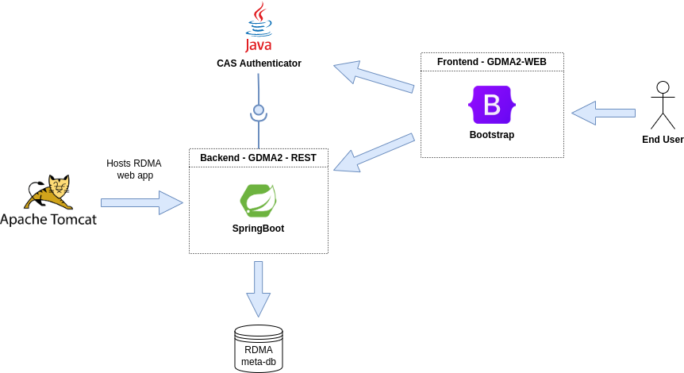

## Installation
The RDMA authentication is delegated to a second Java component (CAS) which is publicly available on Github.
See https://github.com/rdmaorg/cas_single_signon for the installation details and further information.

### RDMA meta-db setup
Create the RDMA meta-db using the RDMBS of your choice. 
In this README we'll use a Postgres db:
```
$ psql
$ postgres =# create database rdma;
```
We recommend creating a dedicated user with enough privileges to access the meta-db and populate the needed entities. 
User details will then be specified in the various configuration files used by RDMA/CAS components.

### Building the package
The application requires Apache Maven as a building tool to compile the source code and package it as an executable.
The main POM can be used to define Maven profiles and create customised RDMA configurations:
```
<profile>
    <id><profile_id></id>
    <properties>
        <db.jndi>java:comp/env/jdbc/rdma</db.jndi>
        <log.location><directory_to_the_log_file></log.location>
        <spring.jmx.enabled>true</spring.jmx.enabled>
        <!-- Security -->
        <app.protocol>http</app.protocol>
        <app.hostname><host_where_RDMA_runs></app.hostname>                     <!-- e.g. localhost -->
        <app.port><...></app.port>                                              <!-- e.g. :8080 -->
        <cas.hostname><host_where_cas_runs></cas.hostname>                      <!-- e.g. localhost -->
        <cas.port><...></cas.port>                                              <!-- e.g. :8080 -->
        <authentication.local>false</authentication.local>                      <!-- true if passwordless users are allowed/false otherwise -->
        <db.hibernate.dialect><rdma_sql_dialect_class></db.hibernate.dialect>   <!-- e.g. org.hibernate.dialect.PostgreSQL9Dialect -->
    </properties>
</profile>
```
The project can then be compiled and packaged activating the above profile:
```
mvn clean install -U -P<profile_id> -DskipTests
```
On completion, the generated .war will be located under the local `gdma2-web/target` subfolder.


## Configuration and deployment
Hibernate properties can be customised in the `application.properties` file.
For instance, adjusting the set of properties below could be extremely useful when testing/debugging the application: 
```
  spring.jpa.properties.hibernate.show_sql=true
  spring.jpa.properties.hibernate.use_sql_comments=true
  spring.jpa.properties.hibernate.format_sql=true
  spring.jpa.properties.hibernate.type=trace
```

### Logging
This project uses `Log4J` as logging utility.
Log-specific settings are listed in the relevant [configuration file](src/main/resources/log4j.xml).

### Tomcat context
The JNDI Datasource configuration needs to be adjusted following the [xml template](rdma.xml) provided in the repository:
```
<Resource name="jdbc/rdma" 
      auth="Container" 
      type="javax.sql.DataSource"
      driverClassName="<driver_name_here>"    <!-- e.g. org.postgresql.Driver -->
      url="jdbc://<connection_url_to_the_rdma_metadb>"
      maxActive="100"
      maxIdle="30" 
      maxWait="10000" 
      validationQuery="select 1" />
```
Once the executable is built and the template ready, the war can be uploaded via the Tomcat UI.

### Windows
Alternatively, a [helper script](deployTomcat.bat) is also provided as part of the base repository, to help with the tomcat deployment on a Windows box.
Additionally, the `rdma.xml` file updated in the previous step, needs to be copied under `{CATALINA.HOME}\conf\Catalina\localhost`.

### Linux
For a manual deployment in a linux-like environment, copy the build under `$CATALINA_HOME/webapps` and then start the Tomcat server (`startup.sh`).
The context path in linux is `$CATALINA_HOME/conf/Catalina/localhost`.

## Post deployment steps
After the installation, RDMA will automatically create and populate all the needed meta tables.
Once done, access the meta-db and create your first `administrator` user: 
```
$ postgres=# \c rdma
$ rdma=# \d users_gdma2
                       Table "public.users_gdma2"
    Column     |          Type          | Collation | Nullable | Default
---------------+------------------------+-----------+----------+---------
 id            | integer                |           | not null |
 active        | boolean                |           | not null |
 is_admin      | boolean                |           | not null |
 user_domain   | character varying(255) |           |          |
 first_name    | character varying(255) |           | not null |
 last_name     | character varying(255) |           | not null |
 is_locked     | boolean                |           | not null |
 user_password | character varying(255) |           |          |
 username      | character varying(255) |           | not null |
Indexes:
    "users_gdma2_pkey" PRIMARY KEY, btree (id)

$ rdma =# insert into users_gdma2 values (nextval('seq_users_gdma2'), true, true, null, 'test', 'user', false, 'admin', 'admin');
```


## RDMA Interface and functionalities
The landing RDMA page will now look as follows and user will be required to log in for the first time:

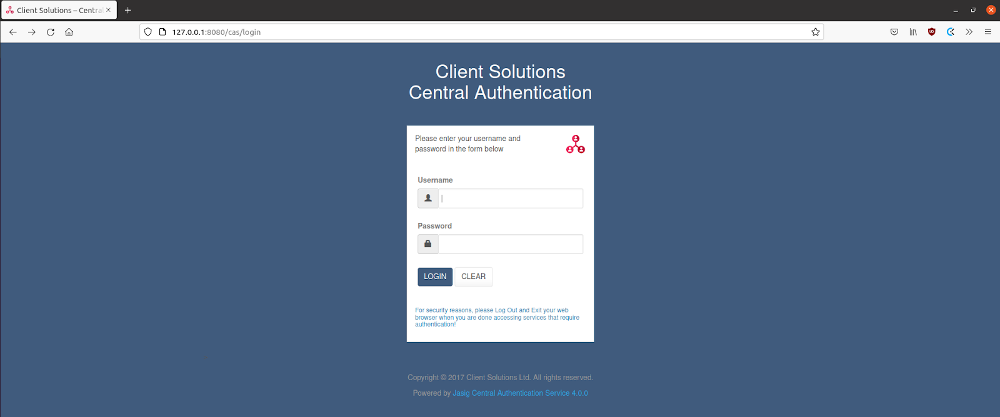

### Managing users and roles
_Configuration -> Users_

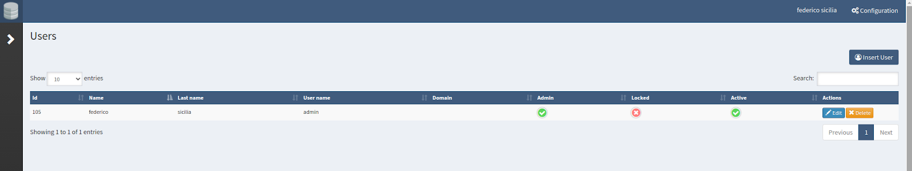

Users and roles can be added/managed directly from the UI.
In order to add a new user click on the `Insert User` button and complete the form with all required fields (note that user details can be updated/amended anytime (`Edit` button)):

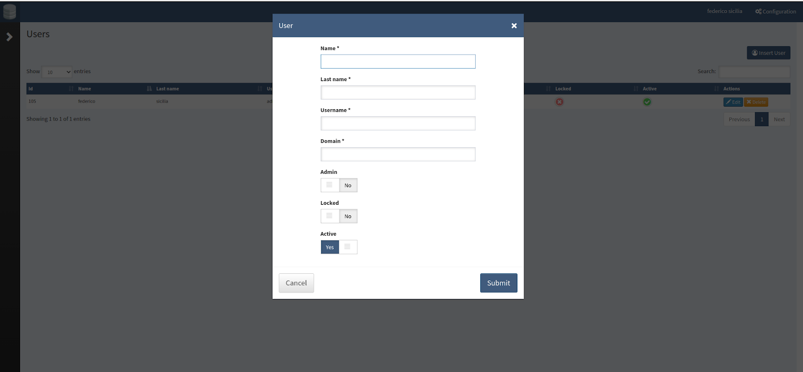

### Checking logs
RDMA keeps track of all the activities in logs and can be consulted in the _Configuration-> Activity_ page:

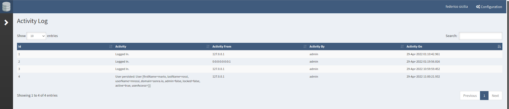

### Adding new servers
_Configuration -> Server_

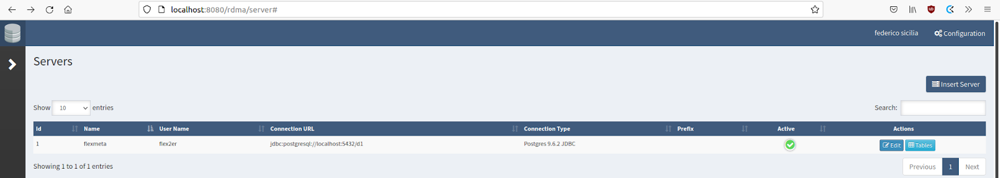

To create a new connection to one of the supported dbs, click on `Insert Server` and provide all the connection details.

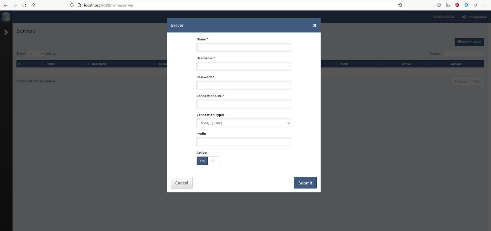

### Managing tables
Once a new server is added, you can navigate through the list of available tables and choose which ones to assign to the various users.

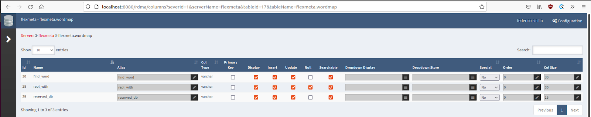

Administrators must grant access/permissions (_Select - Upsert - Delete_) on each table individually.

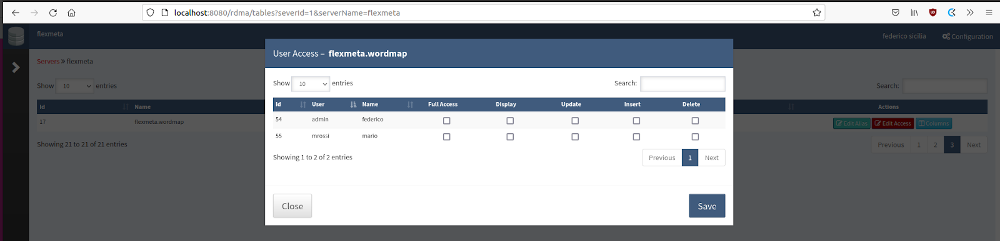

### View data
Users will see their _“authorized”_ tables in the server list menu:

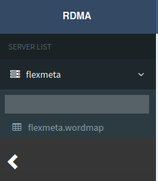

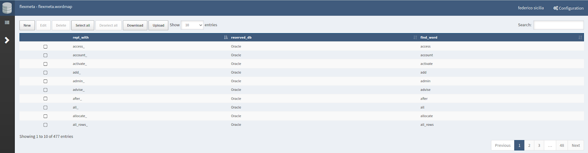


### Edit table entries
If authorized, users can update/delete/insert table entries directly from the Table page (clicking on the buttons in the top menu and filling the modals).

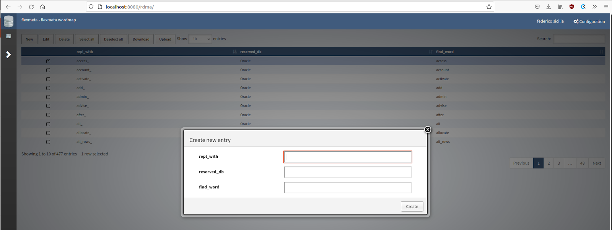

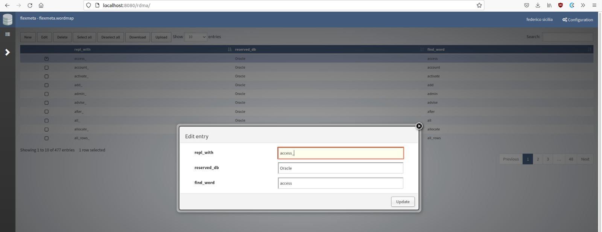

Data can also be exported in csv extracts for local changes:

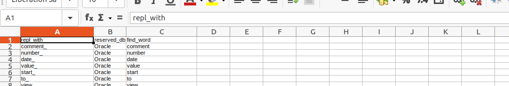


## Issue Reporting
Report any bugs or feature requests in the dedicated [repository issues](https://docs.github.com/en/issues/tracking-your-work-with-issues/creating-an-issue) section. 

## License
Please consult the LICENSE file and the COPYRIGHT notice. 
